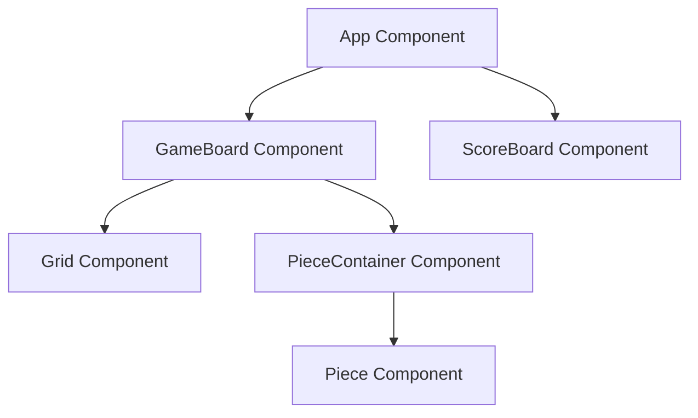

# Block Pop 설계서 (Design Document)

> Version: 1.0.0 | Created: 2026-03-08 | Status: Draft

## 1. 개요 (Overview)
"Block Pop"은 React와 TypeScript를 기반으로 한 웹 기반 블록 퍼즐 게임입니다. 플레이어는 8x8 격자판에 무작위로 생성된 블록 조각을 드래그 앤 드롭하여 배치하고, 가로 또는 세로 줄을 채워 점수를 획득하는 구조입니다.

## 2. 아키텍처 (Architecture)
### 시스템 다이아몬드 (System Diagram)


### 컴포넌트 (Components)
- **App**: 전체 게임 상태(점수, 게임 종료 여부)를 관리하고 레이아웃을 구성합니다.
- **GameBoard**: 8x8 그리드와 현재 사용 가능한 블록 조각들을 렌더링하고 상호작용(드래그 앤 드롭)을 처리합니다.
- **Grid**: 실제 8x8 격자판을 렌더링하며, 각 셀의 상태(비어 있음/블록 있음)를 시각화합니다.
- **PieceContainer**: 플레이어가 선택할 수 있는 3개의 무작위 블록 조각을 보여줍니다.
- **Piece**: 개별 블록 조각을 렌더링하며, 드래그 기능을 포함합니다.

## 3. 데이터 모델 (Data Model)
### 주요 엔티티 (Entities)
```typescript
// 그리드 셀 상태
type CellState = {
  filled: boolean;
  color?: string; // 블록의 색상
};

// 8x8 그리드 데이터 구조
type GridData = CellState[][];

// 블록 모양 (좌표 시스템)
interface PieceShape {
  id: string;
  shape: number[][]; // 예: [[1,1], [1,1]] (2x2 사각형)
  color: string;
}

// 게임 상태
interface GameState {
  grid: GridData;
  score: number;
  currentPieces: PieceShape[];
  isGameOver: boolean;
}
```

## 4. 로직 상세 (Logic Details)
- **배치 유효성 검사**: 선택한 블록이 그리드 범위를 벗어나지 않는지, 기존 블록과 겹치지 않는지 확인합니다.
- **줄 제거 로직**: 블록 배치 후, 가로 또는 세로 방향으로 한 줄이 꽉 찼는지 검사하고 해당 줄을 초기화합니다.
- **게임 종료 판정**: 현재 제공된 모든 조각을 그리드 어디에도 배치할 수 없을 때 종료 처리합니다.
- **점수 시스템**: 배치된 블록 수 + 제거된 줄 수에 따라 가중치를 부여합니다.

## 5. UI 디자인 (UI Design)
- **그리드**: 어두운 배경의 8x8 격자.
- **블록**: 채도 높은 다양한 색상(Neon-style).
- **애니메이션**: 줄 제거 시 블록이 작아지며 사라지는 "Pop" 효과 (CSS Keyframes 활용).

## 6. 테스트 계획 (Test Plan)
| 테스트 케이스 | 기대 결과 |
|---------------|-----------|
| 블록 배치 성공 | 그리드 데이터 업데이트 및 렌더링 반영 |
| 겹치는 위치 배치 시도 | 배치 차단 및 원래 위치로 복귀 |
| 가로/세로 줄 완성 | 해당 줄의 블록 제거 및 점수 증가 |
| 배치 가능 공간 없음 | 게임 종료 팝업 노출 |
